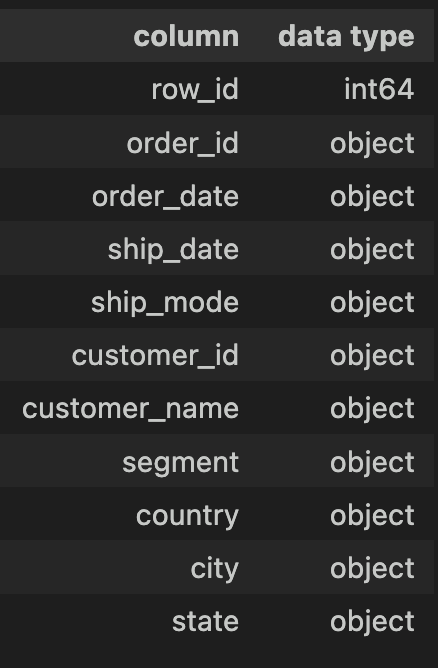
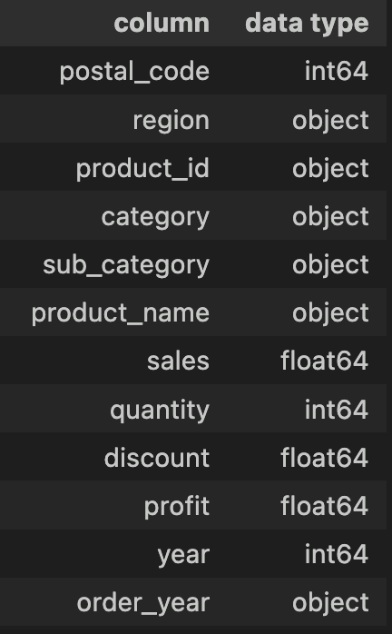
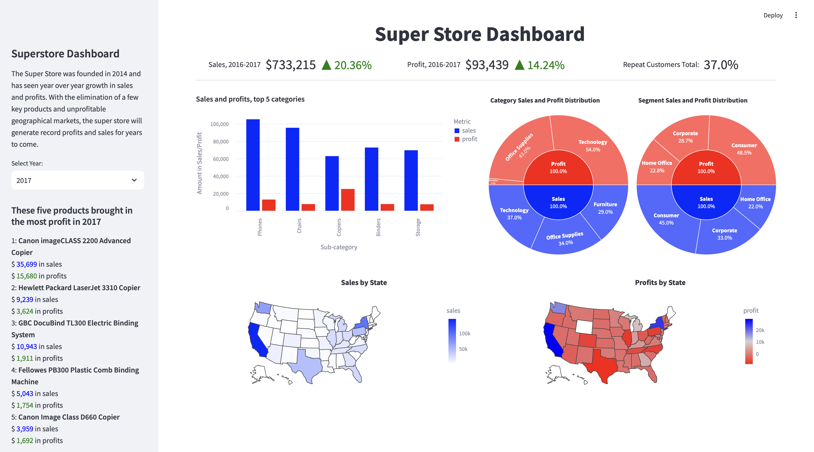

# Project Background

**Overview:** The goal of the super store analysis is to analyze the distribution of sales and profits between the years 2014-2017. The analysis and dashboard provides data to inform stakeholders on which products to promote and discontinue; in addition, highlights markets that are performing well and ones that are not.

- Insights are provided based on profit and sales metrics.
- The pandas queries used to analyze the data can be found [here.](https://github.com/Dilcia19/superstore_analysis/blob/main/scripts/superstore_analysis.py)
- The code powering the dashboard can be found [here.](https://github.com/Dilcia19/superstore_analysis/blob/main/scripts/main.py)

**Data Source:** Data from the superstore was downloaded from the [Kaggle](https://www.kaggle.com/datasets/vivek468/superstore-dataset-final?resource=download). The Superstore has collected data since 2014 and had an overall growth trajectory from 2014 to 2017. The insights in this report aim to propel the Superstore into further growth and financial success.

**Tools:** Data cleaning and analysis were done with pandas. The dashboard was built with streamlit, a python framework that allows data analysts to build interactive dashboards without the need for directly building out having to develop the front-end with HTML, CSS and Javascript.

# Data Structure

The data consists of one table `Store Records` with the following structure:

  
   

# Executive Summary

**Overview of Findings**

In 2017, the Superstore had its best year in terms of sales and profits. The store has seen year over year growth and is doing well in the New York and California markets. From 2016 to 2017, the store saw a 14% increase in profits and a 20% increase in sales revenue. 

Nearly 40% of customers who made a purchase have come back to make another purchase. Overall, health for the Superstore is in the green. Unfortunately, the store is not doing well in the states of Texas and Illinois and has poor profit margins in the furniiture segment.

**Key Findings**

Troublesome Markets:
- Year after year, Texas and Illinois profits were consistently negative. In 2014, Texas had a net profit of -$9,000 and has remained negative, although the loss in profits fluctuate significantly year to year.
- Illinois had a net profit of -$2,000 in 2014, but by 2017, that number had dropped to -$6,000.

Troublesome Segments:
- In 2014, the furniture segment accounted for 11% of Superstore profits, but by 2017, that number had dropped to 3%.
- Meanwhile the furniture segment consistently accounted for about 30% of sales annually.

Trouble Products:
- `Cubify CubeX 3D Printer`, a machines sold by the Superstore, have consistently lost the superstore money. 
- The two versions of this product: `Cubify CubeX 3D Printer Double Head Print` and `Cubify CubeX 3D Printer Triple Head Print` have appeared on the list of biggest profit losers 3 out of 4 years of operation.
- It is likely time to drop this product. 

Great Products:
- In terms of products to invest in, copiers do well - they sell for a higher price point and are often in the list for top profitable products of the year.

